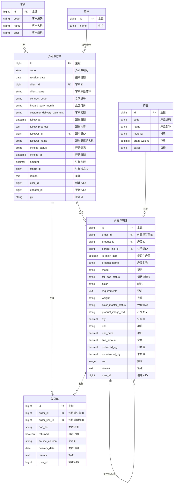

```mermaid
erDiagram
    客户 ||--o{ 外跟单订单 : "下单"
    用户 ||--o{ 外跟单订单 : "跟单/制单"
    外跟单订单 ||--o{ 外跟单明细 : "包含"
    产品 ||--o{ 外跟单明细 : "匹配"
    外跟单明细 ||--o{ 外跟单明细 : "主产品-配件"
    外跟单订单 ||--o{ 发货单 : "关联"
    外跟单明细 ||--o{ 发货单 : "发货"

    客户 {
      bigint id PK "主键"
      string code "客户编码"
      string name "客户名称"
      string abbr "客户简称"
    }

    用户 {
      bigint id PK "主键"
      string name "姓名"
    }

    产品 {
      bigint id PK "主键"
      string code "产品编码"
      string name "产品名称"
      string material "材质"
      decimal gram_weight "克重"
      string caliber "口径"
    }

    外跟单订单 {
      bigint id PK "主键"
      string code "外跟单编号"
      date receive_date "接单日期"
      bigint client_id FK "客户ID"
      string client_name "客户原始名称"
      string contract_code "合同编号"
      string hazard_pack_month "危包月份"
      string customer_delivery_date_text "客户交期"
      datetime follow_at "跟进日期"
      text follow_progress "跟进内容"
      bigint follower_id FK "跟单员ID"
      string follower_name "跟单员原始名称"
      string invoice_status "开票情况"
      datetime invoice_at "开票日期"
      decimal amount "订单金额"
      bigint status_id "订单状态ID"
      text remark "备注"
      bigint user_id "创建人ID"
      bigint updater_id "更新人ID"
      string py "拼音码"
    }

    外跟单明细 {
      bigint id PK "主键"
      bigint order_id FK "外跟单订单ID"
      bigint product_id FK "产品ID"
      bigint parent_line_id FK "父明细ID"
      boolean is_main_item "是否主产品"
      string product_name "产品名称"
      string model "型号"
      string foil_pad_status "铝箔垫情况"
      string color "颜色"
      text requirements "要求"
      string weight "克重"
      string color_master_status "色母情况"
      string product_image_text "产品图文"
      decimal qty "订单量"
      string unit "单位"
      decimal unit_price "单价"
      decimal line_amount "金额"
      decimal delivered_qty "已发量"
      decimal undelivered_qty "未发量"
      integer sort "排序"
      text remark "备注"
      bigint user_id "创建人ID"
    }

    发货单 {
      bigint id PK "主键"
      bigint order_id FK "外跟单订单ID"
      bigint order_line_id FK "外跟单明细ID"
      string doc_no "发货单号"
      boolean returned "是否已回"
      string source_column "来源列"
      date delivery_date "发货日期"
      text remark "备注"
      bigint user_id "创建人ID"
    }

```
