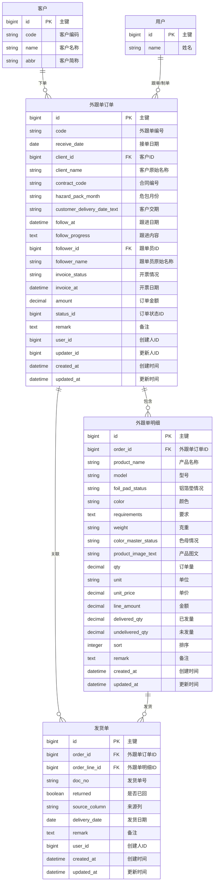

# 外跟单-客户订单表 数据库设计方案

## Context

南通高强包装有限公司目前使用 Excel 手工管理订单和生产流程。其中 `1.外跟单-客户订单表.xlsx` 是客户订单进度一览表，当前工作簿包含 1 个 sheet、26 列、约 1143 行数据。

外跟单主要承载客户订单的跟进信息，包括接单日期、客户、合同编号、产品明细、危包月份、客户交期、发货情况、开票情况、跟单员和备注。

目标：将外跟单 Excel 抽象为结构化数据库实体，为后续外跟单管理、查询、发货单回单跟踪和 Excel 导入打基础。

## 设计原则

- 外跟单作为独立业务模块，命名空间使用 `Wgd`，数据库表名前缀使用 `wgd_`。
- 客户复用现有 `Crm::Client`，不重复建立客户表。
- 跟单员、创建人、更新人复用现有 `User`。
- 外跟单明细暂不关联产品主数据，不保存 `product_id`，先保留 Excel 中的产品名称、型号、颜色等原始文本。
- 外跟单明细暂不设计父子关系，不保存 `parent_line_id` 和 `is_main_item`；瓶、桶、盖、量杯都作为平级明细，通过 `sort` 保持 Excel 原始顺序。
- 外跟单主表暂不保存拼音码，不增加 `py` 字段。
- 发货单从 Excel 的“发货单-未回/已回”列中抽象为独立实体，便于后续查询未回单据。

## Excel 字段映射

| Excel 列 | 中文字段 | 建议落库位置 |
|---|---|---|
| A | 接单日期 | `wgd_orders.receive_date` |
| B | 客户 | `wgd_orders.client_name`，可匹配 `client_id` |
| C | 合同编号 | `wgd_orders.contract_code` |
| D | 产品名称 | `wgd_order_lines.product_name` |
| E | 型号 | `wgd_order_lines.model` |
| F | 铝箔垫情况 | `wgd_order_lines.foil_pad_status` |
| G | 颜色 | `wgd_order_lines.color` |
| H | 要求 | `wgd_order_lines.requirements` |
| I | 克重 | `wgd_order_lines.weight` |
| J | 色母情况 | `wgd_order_lines.color_master_status` |
| K | 产品图文 | `wgd_order_lines.product_image_text` |
| L | 订单量 | `wgd_order_lines.qty` |
| M | 单位 | `wgd_order_lines.unit` |
| N | 危包月份 | `wgd_orders.hazard_pack_month` |
| O | 客户交期 | `wgd_orders.customer_delivery_date_text` |
| P | 跟进日期 | `wgd_orders.follow_at` |
| Q | 单价 | `wgd_order_lines.unit_price` |
| R | 金额 | `wgd_order_lines.line_amount`，订单汇总可写入 `wgd_orders.amount` |
| S | 已发量 | `wgd_order_lines.delivered_qty` |
| T | 未发量 | `wgd_order_lines.undelivered_qty` |
| U | 开票情况 | `wgd_orders.invoice_status` |
| V | 开票日期 | `wgd_orders.invoice_at` |
| W | 发货单-未回 | `wgd_delivery_notes`，`returned = false` |
| X | 发货单-已回 | `wgd_delivery_notes`，`returned = true` |
| Y | 跟单员 | `wgd_orders.follower_name`，可匹配 `follower_id` |
| Z | 备注 | `wgd_orders.remark` 或 `wgd_order_lines.remark` |

## 实体抽象

### 1. 外跟单订单 `wgd_orders`

外跟单主表，对应 Excel 中一组订单头信息。由于 Excel 中同一个订单可能跨多行，导入时应以前一条非空订单头作为后续明细行的所属订单。

| 字段 | 类型 | 说明 |
|---|---|---|
| id | bigint | 主键 |
| code | string | 外跟单编号，可使用单号规则生成 |
| receive_date | date | 接单日期 |
| client_id | bigint | 客户ID，关联 `crm_clients`，可为空 |
| client_name | string | Excel 客户原始名称 |
| contract_code | string | 合同编号 |
| hazard_pack_month | string | 危包月份 |
| customer_delivery_date_text | string | 客户交期，保留文本以兼容“按一周交瓶子”等内容 |
| follow_at | datetime | 跟进日期 |
| follow_progress | text | 跟进内容 |
| follower_id | bigint | 跟单员ID，关联 `users`，可为空 |
| follower_name | string | Excel 跟单员原始名称 |
| invoice_status | string | 开票情况 |
| invoice_at | datetime | 开票日期 |
| amount | decimal | 订单金额，可由明细金额汇总 |
| status_id | bigint | 订单状态ID，可关联 `properties` |
| remark | text | 备注 |
| user_id | bigint | 创建人ID |
| updater_id | bigint | 更新人ID |
| created_at | datetime | 创建时间 |
| updated_at | datetime | 更新时间 |

### 2. 外跟单明细 `wgd_order_lines`

外跟单明细表，对应 Excel 中每一行产品记录。当前不区分主产品和配件，不建立父子关系。

| 字段 | 类型 | 说明 |
|---|---|---|
| id | bigint | 主键 |
| order_id | bigint | 外跟单订单ID，关联 `wgd_orders` |
| product_name | string | 产品名称 |
| model | string | 型号 |
| foil_pad_status | string | 铝箔垫情况 |
| color | string | 颜色 |
| requirements | text | 要求 |
| weight | string | 克重，保留如 `120G` 的原始格式 |
| color_master_status | string | 色母情况 |
| product_image_text | string | 产品图文说明 |
| qty | decimal | 订单量 |
| unit | string | 单位 |
| unit_price | decimal | 单价 |
| line_amount | decimal | 明细金额 |
| delivered_qty | decimal | 已发量 |
| undelivered_qty | decimal | 未发量 |
| sort | integer | 排序，保留 Excel 行内顺序 |
| remark | text | 备注 |
| created_at | datetime | 创建时间 |
| updated_at | datetime | 更新时间 |

### 3. 发货单 `wgd_delivery_notes`

发货单表，从 Excel 的“发货单-未回”和“发货单-已回”拆分而来。一格中多个发货单号用 `/` 分隔时，导入为多条记录。

| 字段 | 类型 | 说明 |
|---|---|---|
| id | bigint | 主键 |
| order_id | bigint | 外跟单订单ID，关联 `wgd_orders` |
| order_line_id | bigint | 外跟单明细ID，关联 `wgd_order_lines` |
| doc_no | string | 发货单号 |
| returned | boolean | 是否已回 |
| source_column | string | 来源列，取值如 `未回`、`已回` |
| delivery_date | date | 发货日期，当前 Excel 无明确日期，可为空 |
| remark | text | 备注 |
| user_id | bigint | 创建人ID |
| created_at | datetime | 创建时间 |
| updated_at | datetime | 更新时间 |

## 实体关系图 ER



## Rails 实现建议

### 文件结构

| 类型 | 文件 |
|---|---|
| Model | `admin_api/app/models/wgd/order.rb` |
| Model | `admin_api/app/models/wgd/order_line.rb` |
| Model | `admin_api/app/models/wgd/delivery_note.rb` |
| Controller | `admin_api/app/controllers/api/v1/wgd/orders_controller.rb` |
| Controller | `admin_api/app/controllers/api/v1/wgd/order_lines_controller.rb` |
| Controller | `admin_api/app/controllers/api/v1/wgd/delivery_notes_controller.rb` |
| Routes | `admin_api/config/routes/wgd.rb` |
| Migration | `admin_api/db/migrate/xxxxxx_create_wgd_orders.rb` |
| Migration | `admin_api/db/migrate/xxxxxx_create_wgd_order_lines.rb` |
| Migration | `admin_api/db/migrate/xxxxxx_create_wgd_delivery_notes.rb` |

### 模型关系

```ruby
class Wgd::Order < ApplicationRecord
  self.table_name = "wgd_orders"

  belongs_to :client, class_name: "Crm::Client", optional: true
  belongs_to :follower, class_name: "User", optional: true
  belongs_to :user, class_name: "User", optional: true
  belongs_to :updater, class_name: "User", optional: true

  has_many :order_lines, class_name: "Wgd::OrderLine", foreign_key: "order_id", dependent: :destroy
  has_many :delivery_notes, class_name: "Wgd::DeliveryNote", foreign_key: "order_id", dependent: :destroy
end

class Wgd::OrderLine < ApplicationRecord
  self.table_name = "wgd_order_lines"

  belongs_to :order, class_name: "Wgd::Order", foreign_key: "order_id"
  has_many :delivery_notes, class_name: "Wgd::DeliveryNote", foreign_key: "order_line_id", dependent: :destroy
end

class Wgd::DeliveryNote < ApplicationRecord
  self.table_name = "wgd_delivery_notes"

  belongs_to :order, class_name: "Wgd::Order", foreign_key: "order_id"
  belongs_to :order_line, class_name: "Wgd::OrderLine", foreign_key: "order_line_id", optional: true
  belongs_to :user, class_name: "User", optional: true
end
```

## 后续可选扩展

- 产品匹配稳定后，可再给 `wgd_order_lines` 增加 `product_id` 关联 `mat_products`。
- 如果需要成套产品结构，再增加 `parent_line_id` 和 `is_main_item`。
- 如果危包证需要管理证书号、UN、有效期，可新增 `wgd_dangerous_package_certs`。
- 如果开票需要多张发票、发票号、金额拆分，可新增独立发票表。
- 如果要批量导入 Excel，可新增导入服务，将订单头、明细和发货单拆分写入三张表。

## 验证方式

1. 对照 Excel 表头确认字段覆盖完整。
2. 跑 `bin/rails db:migrate` 确认迁移成功。
3. 手动创建一个外跟单订单，包含多条平级明细。
4. 验证删除外跟单订单时，明细和发货单同步删除。
5. 用 Excel 中包含未回/已回发货单的真实行验证 `wgd_delivery_notes.returned` 是否正确。
